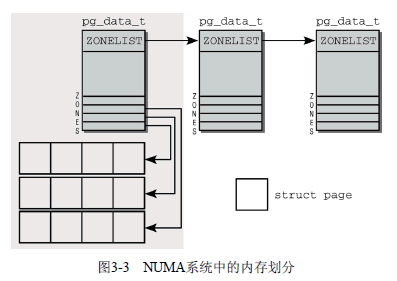

UMA Uniform-Memory-Access  architecture  

多个处理器共享内存，需要保证内存访问的一致性

NUMA Nonuniform-Memory-Access architecture

每个处理器有自己的loacl memory。 通过Memeory Controller Hub来访问其他处理器的本地内存。




如图3-2所示。

在NUMA体系下。

首先内存被划分为结点，每个结点关联到一个处理器(NUMA 结点)，内核中用`pg_data_t`表示。

结点又被划分为内存域，对应图中的zones。使用`enum zone_type`来区分。

每个内存域关联一个数组，用来组织属于该内存域的**物理内存页**（页帧，使用 `struct page`表示）。

每个NUMA结点提供一个 备用列表(ZONELIST)，该列表包含了其他结点（和相关的内存域），当当前NUMA结点内存不够时，可用于代替当前结点分配内存。列表项的位置越靠后，就越不适合分配。


```c
enum zone_type {
#ifdef CONFIG_ZONE_DMA
	/*
	 * ZONE_DMA is used when there are devices that are not able
	 * to do DMA to all of addressable memory (ZONE_NORMAL). Then we
	 * carve out the portion of memory that is needed for these devices.
	 * The range is arch specific.
	 *
	 * Some examples
	 *
	 * Architecture		Limit
	 * ---------------------------
	 * parisc, ia64, sparc	<4G
	 * s390			<2G
	 * arm			Various
	 * alpha		Unlimited or 0-16MB.
	 *
	 * i386, x86_64 and multiple other arches
	 * 			<16M.
	 */
	ZONE_DMA,
#endif
#ifdef CONFIG_ZONE_DMA32
	/*
	 * x86_64 needs two ZONE_DMAs because it supports devices that are
	 * only able to do DMA to the lower 16M but also 32 bit devices that
	 * can only do DMA areas below 4G.
	 */
	ZONE_DMA32,
#endif
	/*
	 * Normal addressable memory is in ZONE_NORMAL. DMA operations can be
	 * performed on pages in ZONE_NORMAL if the DMA devices support
	 * transfers to all addressable memory.
	 */
	ZONE_NORMAL,
#ifdef CONFIG_HIGHMEM
	/*
	 * A memory area that is only addressable by the kernel through
	 * mapping portions into its own address space. This is for example
	 * used by i386 to allow the kernel to address the memory beyond
	 * 900MB. The kernel will set up special mappings (page
	 * table entries on i386) for each page that the kernel needs to
	 * access.
	 */
	ZONE_HIGHMEM,
#endif
	ZONE_MOVABLE, //用于内存碎片优化
	MAX_NR_ZONES //结束标志
};

```


### 数据结构

1. 结点`pg_data_t`

   ```c
   
   /*
    * The pg_data_t structure is used in machines with CONFIG_DISCONTIGMEM
    * (mostly NUMA machines?) to denote a higher-level memory zone than the
    * zone denotes.
    *
    * On NUMA machines, each NUMA node would have a pg_data_t to describe
    * it's memory layout.
    *
    * Memory statistics and page replacement data structures are maintained on a
    * per-zone basis.
    */
   struct bootmem_data;
   typedef struct pglist_data {
   	struct zone node_zones[MAX_NR_ZONES];
   	struct zonelist node_zonelists[MAX_ZONELISTS];
   	int nr_zones;
   #ifdef CONFIG_FLAT_NODE_MEM_MAP
   	struct page *node_mem_map;
   #endif
   	struct bootmem_data *bdata;
   #ifdef CONFIG_MEMORY_HOTPLUG
   	/*
   	 * Must be held any time you expect node_start_pfn, node_present_pages
   	 * or node_spanned_pages stay constant.  Holding this will also
   	 * guarantee that any pfn_valid() stays that way.
   	 *
   	 * Nests above zone->lock and zone->size_seqlock.
   	 */
   	spinlock_t node_size_lock;
   #endif
   	unsigned long node_start_pfn;
   	unsigned long node_present_pages; /* total number of physical pages */
   	unsigned long node_spanned_pages; /* total size of physical page
   					     range, including holes */
   	int node_id;
   	wait_queue_head_t kswapd_wait;
   	struct task_struct *kswapd;
   	int kswapd_max_order;
   } pg_data_t;
   ```

   - `node_zones`: 包含结点中各内存域的数据结构

   - `node_zonelists`: 指定备用结点及其内存域的列表。当当前结点内存不足时，在备用结点中分配内存。

   - `nr_zones`: 结点中内存域的数目。

   - `node_mem_map` 指向`page`的数组指针，用于描述结点的所有物理内存页。包括所有内存域的页。

   - `bdata`: 系统启动期间，内存管理子系统初始化之前，内核也需要使用内存。内存通过**自举内存分配器**（boot memory allocator）来解决这个问题。`bdata`指向boot memory allocator数据结构的实例。

   - `node_start_pfn`是该NUMA结点第一个**页帧**的逻辑编号。*系统中所有结点的页帧是依次编号的，每个页帧的号码都是全局唯一的（不只是结点内唯一）。*在UMA中，该字段总为0，因为UMA只有一个结点啊。

   - node_present_pages

     
